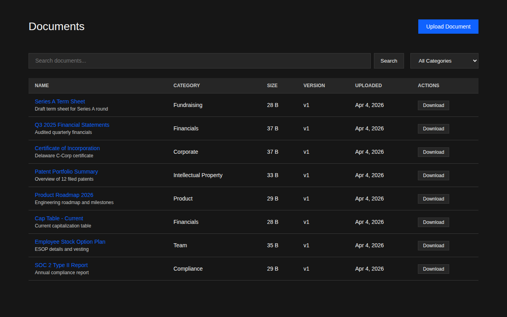

# Due Diligence Portal

A self-hosted portal for companies raising capital to securely share due diligence
documents with investors. Packaged as a single Docker image with a Go API backend
and Svelte 5 frontend.



## Features

- **Document management** -- Upload, categorize, version, and search documents with FTS5
- **Granular permissions** -- Per-document and per-category access grants with expiration
- **Audit logging** -- Immutable log of every access, download, and change
- **NDA gates** -- Require electronic NDA signatures before document access
- **Q&A workflow** -- Structured investor questions with company responses
- **Activity analytics** -- Per-document and per-investor engagement tracking
- **White-label branding** -- Custom colors, logos, CSS, and watermarks
- **Email notifications** -- SMTP-based invites, Q&A alerts, and NDA notifications
- **Air-gapped deployment** -- No CDN fonts or external API calls at runtime

## Quick Start

```bash
# Generate a secret and start with self-signed TLS
export DD_JWT_SECRET=$(openssl rand -hex 32)
docker compose -f docker/docker-compose.yml up -d

# Check the logs for the admin password
docker logs dd-portal 2>&1 | grep "admin password"
```

Then open `https://localhost` (accept the self-signed certificate warning).

## Deployment Options

| Mode | Command | Use Case |
| --- | --- | --- |
| Self-signed TLS | `docker compose -f docker/docker-compose.yml up -d` | Development, internal |
| Custom TLS cert | `docker compose -f docker/docker-compose.tls.yml up -d` | Production |
| HTTP (behind LB) | `docker compose -f docker/docker-compose.http.yml up -d` | Load-balanced |

See [docs/DEPLOYMENT.md](docs/DEPLOYMENT.md) for full configuration.

## Architecture

```text
Browser --> Go Echo (8080/8443) --> SQLite
              |
              +--> /api/v1/*     REST API (JWT auth)
              +--> /*            SvelteKit static SPA
```

Single Docker image. Single process. Single SQLite database file.
All documents stored as BLOBs in the database (not filesystem).

### Tech Stack

| Layer | Technology |
| --- | --- |
| Backend | Go 1.26, Echo v4 |
| Frontend | Svelte 5, SvelteKit, Carbon Design System |
| Database | SQLite (modernc.org/sqlite, pure Go) |
| Auth | JWT (HS256), bcrypt, invite-only registration |
| Search | SQLite FTS5 full-text search |
| Containerization | Multi-stage Docker (Alpine 3.21) |
| CI/CD | GitHub Actions, GitHub Container Registry |

### Roles

| Role | Can Do |
| --- | --- |
| **Admin** | Everything -- manage users, documents, categories, NDA templates, branding |
| **Company Member** | Upload and manage documents, respond to Q&A |
| **Investor** | View granted documents, ask questions, sign NDAs |

## Development

```bash
# Backend
go build -o portal ./cmd
DD_TLS_MODE=none DD_DB_PATH=./dev.db ./portal

# Frontend (separate terminal, proxies API to :8080)
cd ui && npm install && npm run dev

# Tests
go test ./...                        # 195 Go unit tests
cd ui && npm test                    # 10 Vitest unit tests
./scripts/testing/system-tests.sh    # 60 Docker-based API tests
./scripts/testing/e2e-tests.sh       # 20 Playwright E2E tests
```

## Documentation

| Document | Description |
| --- | --- |
| [docs/USER_GUIDE.md](docs/USER_GUIDE.md) | User manual with annotated screenshots |
| [docs/API.md](docs/API.md) | REST API reference (60+ endpoints) |
| [docs/ENVIRONMENT.md](docs/ENVIRONMENT.md) | All 20 environment variables |
| [docs/TESTING.md](docs/TESTING.md) | Test pyramid, scripts, patterns |
| [docs/DEPLOYMENT.md](docs/DEPLOYMENT.md) | Docker, TLS, backup, email |
| [CLAUDE.md](CLAUDE.md) | AI development guide |

## License

[Apache License 2.0](LICENSE)
