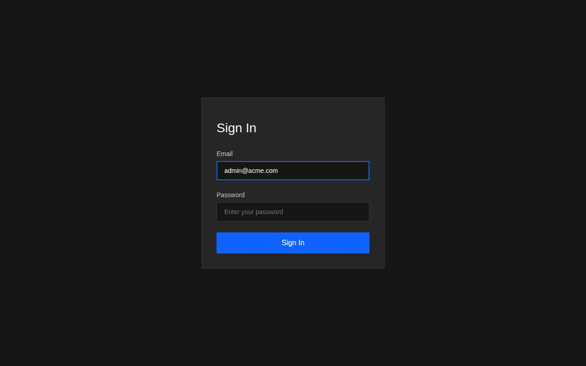
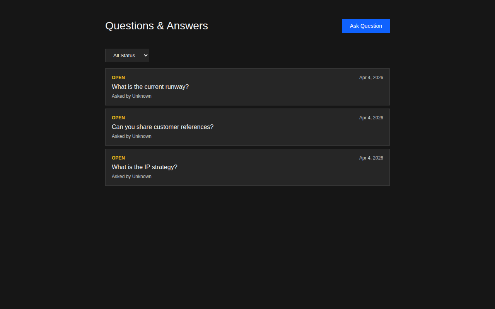
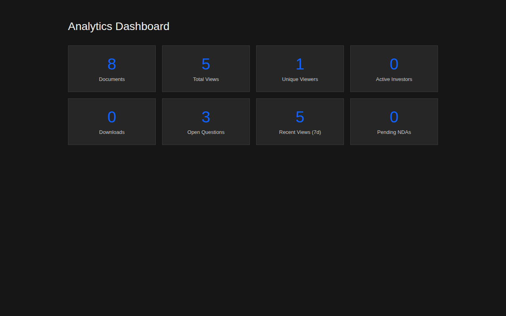
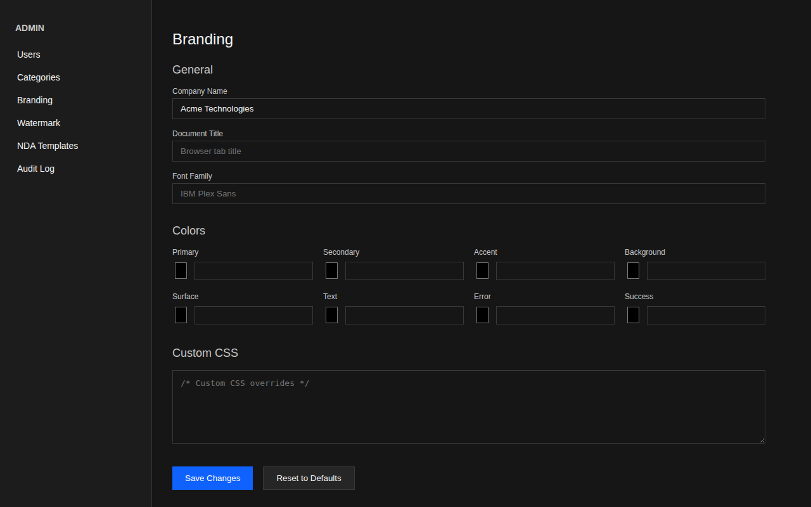
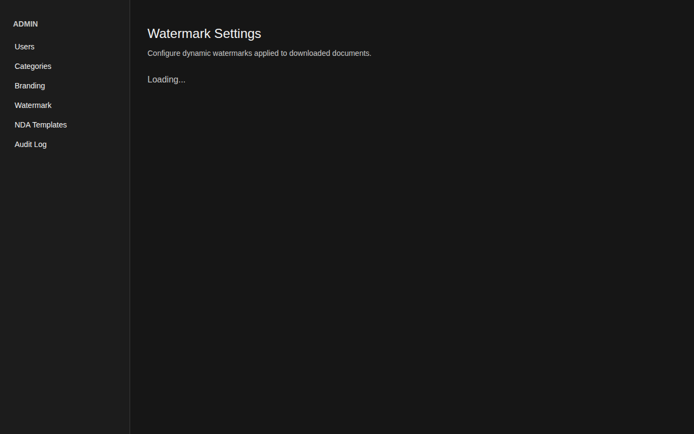
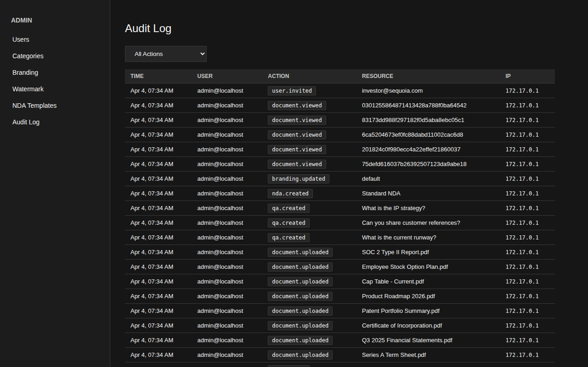

# User Guide

This guide walks through every feature of the Due Diligence Portal with annotated
screenshots.

## Signing In

Navigate to your portal URL. You'll see the login page:

Enter your email address and password, then click **Sign In**. Your account is
created by an administrator via invite -- there is no self-registration.

After signing in, you'll be redirected to the documents page.

## Documents

The documents page is the central hub of the data room:

### Key features

- **Search** -- Use the search bar to find documents by name, description, or tags.
  The portal uses full-text search so partial matches work.
- **Category filter** -- Use the dropdown to filter by category (Corporate,
  Financials, Legal, IP, Team, Product, Fundraising, Compliance, Market).
- **Upload** -- Click **Upload Document** (admin/company members only) to add
  new files. Supported: PDF, Word, Excel, images, and more (up to 100MB).
- **Download** -- Click the **Download** link on any document row.
- **Versioning** -- Each document tracks version history. Upload new versions
  without losing previous ones.

### Document categories

The portal ships with 10 standard due diligence categories:

| Category | Typical Contents |
| --- | --- |
| Corporate | Certificate of incorporation, bylaws, board minutes |
| Financials | Financial statements, projections, cap table |
| Legal | Contracts, IP assignments, employment agreements |
| Intellectual Property | Patents, trademarks, trade secrets |
| Team | Key personnel resumes, org structure, hiring plan |
| Product | Roadmap, architecture, technical documentation |
| Fundraising | Pitch deck, term sheets, investor updates |
| Compliance | SOC 2, GDPR, regulatory filings |
| Market | Market research, competitive analysis |
| Other | Miscellaneous documents |

## Questions & Answers

The Q&A page provides a structured way for investors to ask questions and
receive responses:

### How Q&A works

1. **Investors** click **Ask Question** and type their question.
2. **Company members** see all questions and can post responses.
3. **Status tracking** -- Questions move through statuses:
   - **Open** -- Awaiting response
   - **Answered** -- Company has responded
   - **Closed** -- Resolved
4. **Internal notes** -- Company members can post internal-only messages
   that investors cannot see (set `is_internal: true` via API).

## Analytics Dashboard

The analytics dashboard shows investor engagement at a glance:

### Metrics

- **Documents** -- Total documents in the data room.
- **Total Views** -- Cumulative document views across all investors.
- **Unique Viewers** -- Number of distinct users who viewed documents.
- **Active Investors** -- Investors who have been active recently.
- **Downloads** -- Total document downloads.
- **Open Questions** -- Unanswered Q&A threads.
- **Recent Views (7d)** -- Views in the last 7 days.
- **Pending NDAs** -- Investors who haven't signed the NDA yet.

This dashboard is visible to **admin** and **company member** roles only.

## Admin: Branding

Customize the portal's appearance with your company's branding:

### Branding options

- **Company Name** -- Displayed throughout the portal.
- **Colors** -- Primary, secondary, accent, background, surface, text, error,
  success. Changes apply instantly via CSS custom properties.
- **Font Family** -- Override the default IBM Plex Sans font.
- **Custom CSS** -- Inject your own CSS for advanced styling (sanitized
  server-side to block dangerous patterns like `@import` and `url()`).
- **Logo assets** -- Upload custom logo, favicon, login background, email
  header, and report header/footer images (up to 2MB each).

## Admin: Watermark

Configure dynamic watermarks applied to downloaded documents:

### Watermark options

- **Enable/Disable** -- Toggle watermarks on all downloads.
- **Text Template** -- Use variables like `{{user_email}}`, `{{user_name}}`,
  `{{date}}`, and `{{document_name}}` to personalize watermarks.
- **Position** -- Diagonal, top, bottom, or center.
- **Opacity** -- How visible the watermark appears (0 = invisible, 1 = solid).
- **Font Size** -- 6pt to 72pt.
- **Color** -- Any hex color value.
- **Live Preview** -- See how the watermark will appear before saving.

## Admin: Audit Log

Every action in the portal is recorded in an immutable audit log:

### What's logged

- **User login/logout**
- **Document uploads, views, and downloads**
- **Permission grants and revocations**
- **NDA signatures**
- **Q&A thread creation and responses**
- **Branding and watermark changes**
- **User invitations and account changes**

Each entry records: timestamp, user email, action type, affected resource,
IP address, and user agent.

Use the **action filter** dropdown to focus on specific event types.

## Admin: NDA Management

Require investors to sign an NDA before accessing documents:

1. Go to **Admin > NDA Templates** and create a template with the NDA text.
2. When an investor logs in and navigates to documents, they'll see the NDA
   signing requirement via the `/api/v1/nda/status` endpoint.
3. After signing, the portal records their name, email, company, IP address,
   and timestamp.
4. View all signatures in **Admin > NDA Templates > Signatures**.

## Admin: User Management

Manage portal users through **Admin > Users**:

- **Invite** -- Send an invite by entering an email and selecting a role
  (Company Member or Investor). The system generates a unique invite link.
- **Roles**:
  - **Admin** -- Full access to all features and settings.
  - **Company Member** -- Can upload/manage documents and respond to Q&A.
  - **Investor** -- Can view granted documents and ask questions.
- **Deactivate** -- Disable a user's access without deleting their data.

## Permissions

Access is controlled at two levels:

1. **Role-based** -- Admins and company members see everything. Investors
   see only what they're granted.
2. **Per-resource** -- Grant specific investors access to individual documents
   or entire categories with access levels:
   - **View** -- Can see the document exists and read metadata.
   - **Download** -- Can download the file.
   - **Upload** -- Can upload new versions.
   - **Manage** -- Full control (includes all above).

Grants can have an **expiration date** for time-limited access.

## Getting Help

- **API Reference**: See [API.md](API.md) for all available endpoints.
- **Deployment**: See [DEPLOYMENT.md](DEPLOYMENT.md) for Docker configuration.
- **Environment Variables**: See [ENVIRONMENT.md](ENVIRONMENT.md) for all settings.
